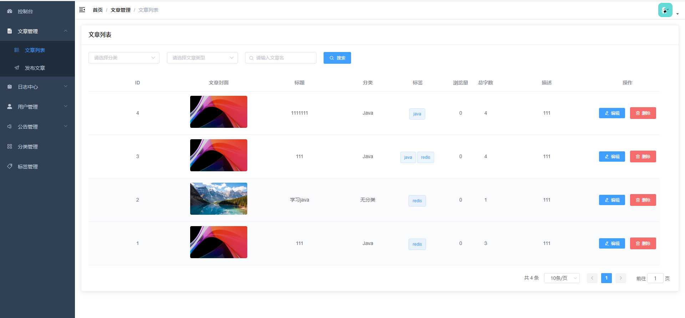
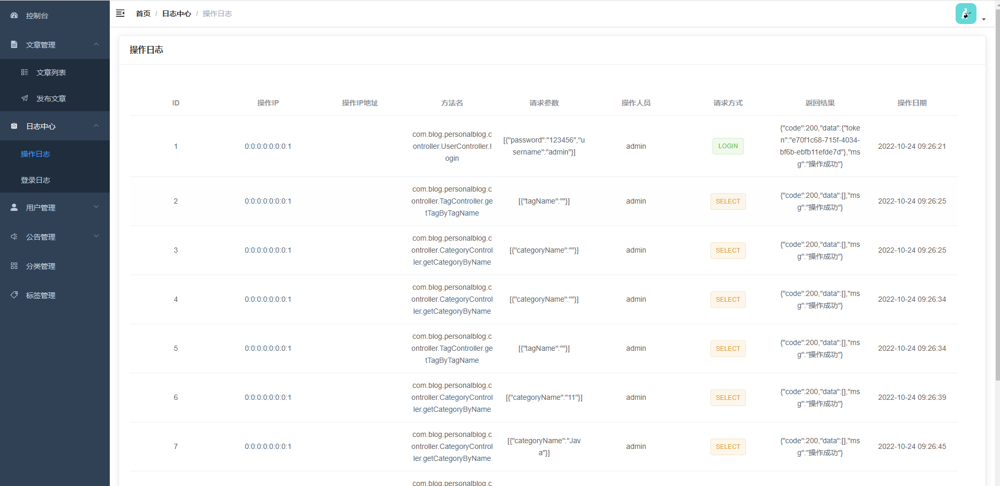
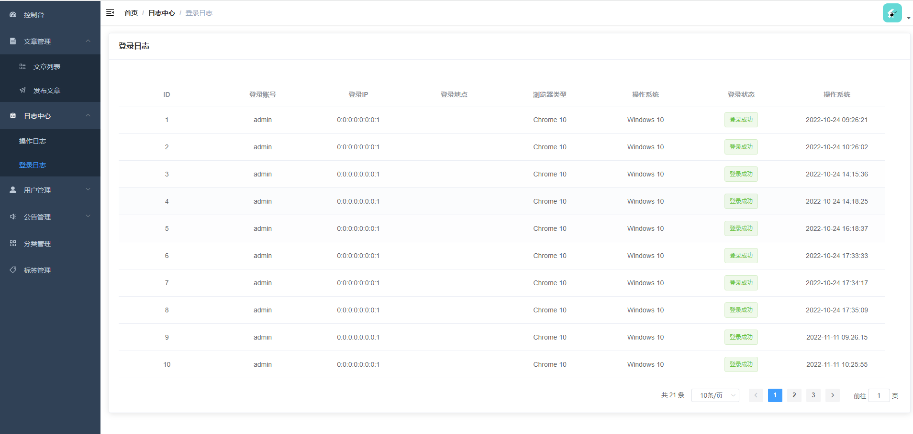
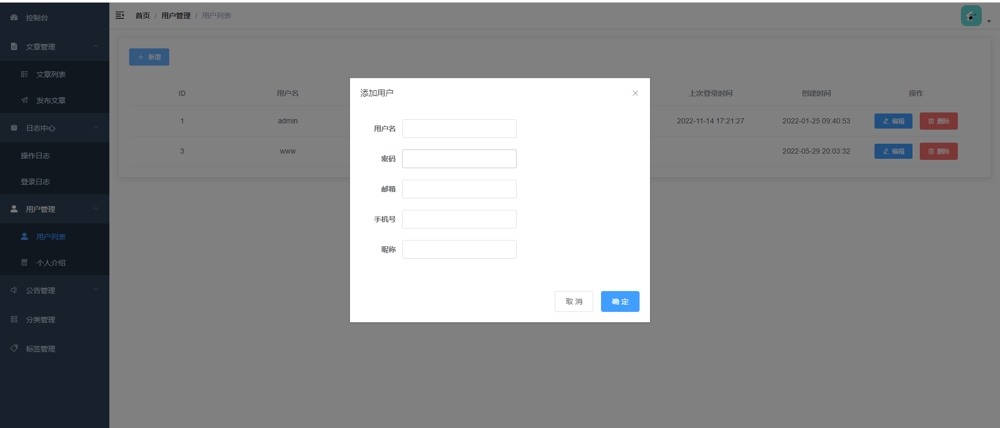

# 个人博客管理系统

## 1、介绍
项目以个人网站为主题，采用前后端分离进行项目的搭建。现在企业大多数都是用Spring Boot + Mybatis搭建后台，我们也要紧跟发展，虽然现在大型的项目都是分布式Spring Cloud，但是我们还是以基础为主，等以后有经历了可以慢慢再深入学习。

管理平台则使用框架vue-element-admin进行搭建快速开发。最后会教大家项目上线等操作，大概也就那么多，后期做项目中，在遇到什么我再进行补充。项目二期的话就是使用uni-app进行移动端开发。手机端的展示，方便快捷。

总的来说，这是一个前后端分离的小项目，采用的都是最基础的知识点，几乎没有太多的难点。我的初心是让大家大概了解做项目的流程，以及编写代码的流程和做项目的思想等。我能力有限，尽量把这个项目基础化，然后通俗的讲出来。俗话说，麻雀虽小，五脏俱全。但当个毕设、小项目练习足够了。个人水平有限，有很多说的可能不对，希望大家理解下，但总体的项目可以运行起来，大家多多点点关注，自豪的白嫖，哈哈！最后希望大家都能学到东西，一起进步。

## 2、详细教程

**前端代码地址**：[https://gitee.com/xyhwh/personal_vue](https://gitee.com/xyhwh/personal_vue)

**如何获得本教程：**

我在微信公众号上发布了个人博客系统的全部开发教程，关注下方微信公众号，找到下方的项目教程即可。


**还可以通过CSDN上去查看本教程：[Spring Boot + vue-element 开发个人博客项目实战教程](https://blog.csdn.net/m0_37779600/article/details/120937543)**


### 运行地址

[http://localhost:9528](http://localhost:9528)

**初始密码为：admin/123456**

## 3、软件架构

### 3.1、后端技术

| 技术 | 说明 | 官方网址 |
| --- | --- | --- |
| Spring Boot | MVC框架和容器 | [ https://spring.io/projects/spring-boot](https://spring.io/projects/spring-boot) |
| MyBatis | 持久层框架 | [https://mybatis.org/mybatis-3/zh/index.html](https://mybatis.org/mybatis-3/zh/index.html) |
| Swagger-UI | 文档生成工具 | [https://github.com/swagger-api/swagger-ui](https://github.com/swagger-api/swagger-ui) |
| Lombok | 简化对象封装工具 | [https://github.com/rzwitserloot/lombok](https://github.com/rzwitserloot/lombok) |
| PageHelper | MyBatis物理分页插件 | [http://git.oschina.net/free/Mybatis_PageHelper](http://git.oschina.net/free/Mybatis_PageHelper) |
| Hutool | Java工具类库 | [https://github.com/looly/hutool](https://github.com/looly/hutool) |
| Shiro | Java安全框架 | [https://shiro.apache.org/](https://shiro.apache.org/) |

### 3.2、前端技术

| 技术 | 说明 | 官方网址 |
| --- | --- | --- |
| Vue | 前端框架 | [ https://vuejs.org/](https://vuejs.org/) |
| vue-element-template | 后台前端解决方案 | https://github.com/PanJiaChen/vue-admin-template |
| vue-router | 路由管理器 | [https://router.vuejs.org/zh/](https://router.vuejs.org/zh/) |
| vue-cli | Vue.js 开发的标准工具 | [https://cli.vuejs.org/zh/](https://cli.vuejs.org/zh/) |

### 3.3、开发工具

| 工具名 | 说明 | 官方网址 |
| --- | --- | --- |
| IntelliJ IDEA 2021.03 | 后端主要开发工具 | [https://www.jetbrains.com/idea/download](https://www.jetbrains.com/idea/download) |
| Navicat | 数据库连接管理工具 | [http://www.formysql.com/xiazai.html](http://www.formysql.com/xiazai.html) |
| Postman | API接口调试工具 | [ https://www.postman.com/](https://www.postman.com/) |
| Xshell | Linux远程连接工具 | [https://www.netsarang.com/zh/xshell-download/](https://www.netsarang.com/zh/xshell-download/) |
| Xftp | 网络传输文件 | [https://www.netsarang.com/zh/xftp-download/](https://www.netsarang.com/zh/xftp-download/) |
| Visual Studio Code | 免费开源的现代化轻量级代码编辑器 | [https://code.visualstudio.com/Download](https://code.visualstudio.com/Download) |
| Typora | Markdown编辑器 | [https://typora.io/](https://typora.io/) |

### 3.4、开发环境

| 工具名 | 说明/版本号 | 官方网址 |
| --- | --- | --- |
| JDK | 软件开发工具包/1.8 | [https://www.oracle.com/java/technologies/downloads/#java8-windows](https://www.oracle.com/java/technologies/downloads/#java8-windows) |
| Mysql | 数据库管理系统/8.1 | [https://www.mysql.com/downloads/](https://www.mysql.com/downloads/) |
| Redis | 非关系型数据库/3.2.100 | [https://redis.io/download](https://redis.io/download) |

## 4、使用说明

### 4.1、数据库

数据库在项目的初始文件中，直接可以在数据库中运行文件中的代码即可创建完表。

**文件名为**：`init.sql`

**初始化用户**：`dml.sql`

### 4.2、数据库配置

当你拿到项目后，创建完数据库后，要去项目的`application.yml`中去配置你的数据库配置。

```yml
  datasource:
    url: jdbc:mysql://# 你本地的IP地址:3306/person_blog?useUnicode=true&characterEncoding=utf8&useSSL=false&allowPublicKeyRetrieval=true&serverTimezone=GMT%2B8
    username: #数据库用户名
    password: #数据库连接密码
    driver-class-name: com.mysql.cj.jdbc.Driver
```

### 4.3、Redis配置

```yml
redis:
    host: # 你的redis地址
    port: # 端口号
    timeout: 300
    password:
```

### 4.4、地址配置

```yml
upload:
  local:
    path: /blog/uploadFile/
    url: # 你本地的访问地址， 例如：http://localhost:8080/blog
```

### 4.5、邮箱配置

```yml
send:
  mail:
    host: # 邮件服务器的SMTP地址
    port: # 邮件服务器的SMTP端口
    from: # 发件人
    pass: # 密码
```


## 5、项目展示

**登录页面**：














